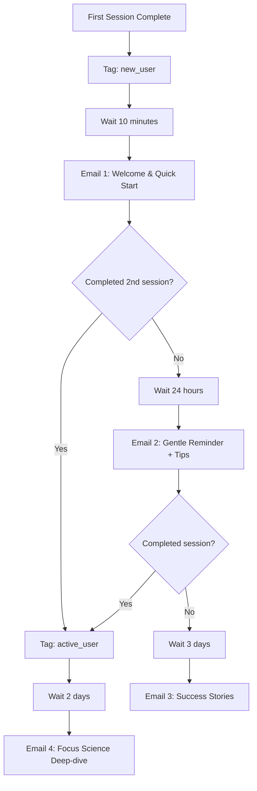

# PomoNest Marketing Automation Workflows

## 🎯 Automation Strategy Overview

**Goal**: Create intelligent, behavior-driven workflows that guide users from awareness to Pro subscription while providing value at every step.

**Key Principles**:
- Trigger-based personalization
- Value-first communication
- Progressive user education
- Seamless cross-platform integration

## 🔄 Core Automation Workflows

### 1. New User Onboarding Workflow

**Trigger**: User completes first app session
**Goal**: Convert trial users to active daily users
**Duration**: 14 days



**Email Sequence**:

**Email 1: Welcome & Quick Start (Immediate)**
```
Subject: Welcome to PomoNest! Your first session was amazing 🎉

Hi [First Name],

Congratulations on completing your first focus session! You just joined 10,000+ people building unbreakable focus habits.

Your next steps to success:
✅ Try a different theme (Ocean is popular for afternoon focus)
✅ Set a 3-day streak goal 
✅ Explore the task integration feature

Quick tip: Users who complete 3 sessions in their first week are 5x more likely to build lasting habits.

Ready for session #2? Just click: [Start Focus Session]

Questions? Just reply - I read every email!

Stay focused,
[Your name]
```

**Email 2: Gentle Reminder + Tips (Day 2 if inactive)**
```
Subject: One quick technique that doubles focus time

Hi [First Name],

I noticed you haven't started your second session yet - no worries! Life gets busy.

Here's a game-changing tip from our most successful users:

🎯 **The "2-Minute Rule"**: Can't start a 25-minute session? Try just 2 minutes.

Often, starting is the hardest part. Once you begin, momentum takes over.

Try it now: [2-Minute Quick Session]

P.S. This trick works for any task - exercise, reading, cleaning. Lower the barrier, build the habit.
```

**Email 3: Success Stories (Day 5 if still inactive)**
```
Subject: "I went from 2 hours to 6 hours of productivity daily"

Hi [First Name],

Meet Sarah, a PomoNest user who transformed her study habits:

"I was getting C's in organic chemistry and felt overwhelmed by everything. The 25-minute chunks made it manageable. Now I'm getting A's and actually enjoy studying."

The secret? She started with just one session per day.

Your turn: [Start Your Comeback Session]

What's your biggest focus challenge? Reply and let me know - I might feature your success story next!
```

### 2. Activation Workflow (Free to Engaged)

**Trigger**: User completes 3+ sessions in first week
**Goal**: Increase engagement and introduce Pro features
**Duration**: 21 days

**Automation Logic**:
```javascript
// Trigger conditions
if (userSessionCount >= 3 && daysSinceSignup <= 7) {
  addTag('engaged_user')
  removeTag('new_user')
  startActivationWorkflow()
}

// Progressive feature introduction
const featureIntroSequence = [
  { day: 1, feature: 'streak_tracking' },
  { day: 4, feature: 'analytics_preview' },
  { day: 7, feature: 'premium_themes' },
  { day: 14, feature: 'advanced_insights' },
  { day: 21, feature: 'pro_upgrade_offer' }
]
```

**Key Emails**:

**Day 1: Streak Psychology**
```
Subject: Why your 3-day streak is more powerful than you think

[Content about habit formation, neuroplasticity, and streak psychology]
```

**Day 7: Analytics Preview**
```
Subject: Your productivity insights are ready 📊

[Show basic analytics, tease advanced Pro features]
```

**Day 14: Premium Theme Introduction**
```
Subject: The theme that boosts focus by 25% (limited preview)

[Introduce premium themes with science backing, offer preview]
```

### 3. Pro Conversion Workflow

**Trigger**: User views Pro features or upgrade prompts
**Goal**: Convert interested users to Pro subscribers
**Duration**: 7 days with follow-up

**Segmentation Strategy**:
```typescript
interface ProProspect {
  trigger: 'upgrade_prompt_view' | 'analytics_click' | 'theme_lock' | 'feature_limit'
  context: {
    streak?: number
    sessionsCompleted?: number
    featureInterested?: string
  }
  engagementLevel: 'high' | 'medium' | 'low'
}

// Dynamic content based on trigger
const getProContent = (prospect: ProProspect) => {
  switch(prospect.trigger) {
    case 'theme_lock':
      return themes_focused_sequence
    case 'analytics_click':
      return insights_focused_sequence
    case 'upgrade_prompt_view':
      return general_pro_sequence
  }
}
```

**Personalized Email Sequence**:

**Email 1: Immediate Value (Trigger + 10 minutes)**
```
// For analytics interest
Subject: Your productivity patterns revealed 🔍

Hi [First Name],

I saw you were interested in your productivity analytics. Smart move!

Here's what Pro users discover about their focus patterns:
• Peak productivity hours (yours might surprise you)
• Session quality trends over time
• Optimal break timing for maximum recovery

[View Sample Analytics Report]

Limited time: Get your first month for $2.50 (50% off)

This offer expires in 48 hours.

Ready to optimize your focus? [Upgrade to Pro]
```

**Email 2: Social Proof (Day 2)**
```
Subject: "I increased my daily productive hours by 40%"

[Customer success stories specific to their interest area]
```

**Email 3: Objection Handling (Day 4)**
```
Subject: Common Pro questions answered

[Address pricing, value, and feature concerns]
```

**Email 4: Urgency + Guarantee (Day 6)**
```
Subject: 24 hours left: Your Pro preview expires soon

[Final chance with money-back guarantee emphasis]
```

### 4. Re-engagement Workflow

**Trigger**: No app activity for 14 days
**Goal**: Bring inactive users back to the app
**Duration**: 10 days

**Segmentation by Previous Engagement**:
```typescript
interface InactiveUser {
  lastActive: Date
  totalSessions: number
  longestStreak: number
  previousEngagement: 'high' | 'medium' | 'low'
  churnRisk: 'high' | 'medium' | 'low'
}

// Personalized re-engagement based on history
const getReengagementStrategy = (user: InactiveUser) => {
  if (user.longestStreak >= 7) {
    return 'streak_builder_return'
  } else if (user.totalSessions >= 10) {
    return 'experienced_user_return'
  } else {
    return 'beginner_friendly_return'
  }
}
```

**Email Sequence**:

**Email 1: Personal Check-in (Day 14 of inactivity)**
```
Subject: Your focus streak is waiting for you...

Hi [First Name],

I noticed it's been a while since your last focus session. No judgment here - life happens!

But here's what I've learned: the hardest part isn't starting again, it's remembering how good productivity feels.

Your PomoNest account is still active:
✅ All your settings saved
✅ Streak ready to restart
✅ New features added since you were last here

One 25-minute session today can restart everything.

[Restart My Focus Journey]

What's been keeping you from focusing? Reply and tell me - I might be able to help.
```

**Email 2: Habit Reset Guide (Day 20)**
```
Subject: The "Fresh Start Effect" - why today is perfect for restart

[Psychology of fresh starts, practical restart strategies]
```

**Email 3: Final Reach (Day 24)**
```
Subject: Should I remove you from focus tips?

[Soft unsubscribe offer with easy return path]
```

### 5. Customer Success Workflow (Pro Users)

**Trigger**: Pro subscription activation
**Goal**: Maximize retention and satisfaction
**Duration**: Ongoing

**Success Milestones**:
```typescript
const proUserMilestones = [
  { day: 1, milestone: 'first_pro_session', reward: 'advanced_tips' },
  { day: 7, milestone: 'week_one_complete', reward: 'productivity_report' },
  { day: 30, milestone: 'month_one_complete', reward: 'pro_community_invite' },
  { day: 90, milestone: 'quarter_complete', reward: 'yearly_discount_offer' }
]
```

**Onboarding Sequence**:

**Email 1: Pro Welcome (Immediate)**
```
Subject: Welcome to PomoNest Pro! Here's how to get 10x more value

Hi [First Name],

Welcome to the Pro community! You just unlocked the full power of PomoNest.

Your Pro quick-start guide:
🎨 Try the new Midnight theme (Pro users report 30% better evening focus)
📊 Check your advanced analytics (found in Settings > Insights)
🛡️ Set up website blocking for distraction-free sessions
👑 Join our private Pro community for tips and accountability

First challenge: Complete 5 Pro sessions this week and I'll send you a personalized productivity report.

[Start Pro Session] [Join Pro Community]

Questions about any Pro features? Just reply!

[Your name]
Pro Success Team
```

### 6. Cross-Platform Engagement Workflow

**Trigger**: Various touchpoints (social media, blog, referrals)
**Goal**: Create omnichannel user experience
**Duration**: Ongoing

**Integration Points**:
```typescript
interface TouchpointData {
  source: 'social_media' | 'blog' | 'referral' | 'product_hunt' | 'search'
  content: string
  utm_campaign: string
  user_intent: 'education' | 'trial' | 'comparison' | 'purchase'
}

// Personalize follow-up based on entry point
const createFollowupSequence = (touchpoint: TouchpointData) => {
  return {
    email_sequence: getRelevantSequence(touchpoint.user_intent),
    social_retargeting: setupRetargetingAds(touchpoint.source),
    content_recommendations: getRelatedContent(touchpoint.content)
  }
}
```

## 🤖 Technical Implementation

### 1. ConvertKit Automation Setup

**API Integration**:
```typescript
// src/lib/automation.ts
export class AutomationEngine {
  private convertKit = new ConvertKitAPI()
  
  async triggerWorkflow(userId: string, workflow: WorkflowType, context?: any) {
    const user = await this.getUserData(userId)
    const triggers = this.getWorkflowTriggers(workflow)
    
    // Add user to appropriate sequence
    await this.convertKit.addSubscriberToSequence(
      user.email,
      triggers.sequenceId,
      { ...user, ...context }
    )
    
    // Track automation event
    analytics.track('Automation Triggered', {
      workflow,
      userId,
      context
    })
  }
  
  async updateUserSegment(userId: string, newSegment: UserSegment) {
    const user = await this.getUserData(userId)
    
    // Remove from old segments
    await this.convertKit.removeTag(user.email, user.currentSegment)
    
    // Add to new segment
    await this.convertKit.addTag(user.email, newSegment)
    
    // Update local database
    await this.updateUserDatabase(userId, { segment: newSegment })
  }
}
```

### 2. Behavior Tracking & Triggers

**Event-Driven Automation**:
```typescript
// src/lib/behaviorTracking.ts
export class BehaviorTracker {
  private automation = new AutomationEngine()
  
  async trackUserAction(userId: string, action: UserAction) {
    const user = await this.getUserProfile(userId)
    const triggers = this.evaluateTriggers(user, action)
    
    for (const trigger of triggers) {
      await this.automation.triggerWorkflow(
        userId,
        trigger.workflow,
        trigger.context
      )
    }
  }
  
  private evaluateTriggers(user: UserProfile, action: UserAction): AutomationTrigger[] {
    const triggers: AutomationTrigger[] = []
    
    // New user onboarding
    if (action.type === 'session_complete' && user.totalSessions === 1) {
      triggers.push({
        workflow: 'new_user_onboarding',
        context: { firstSessionDate: new Date() }
      })
    }
    
    // Activation workflow
    if (action.type === 'session_complete' && user.totalSessions === 3) {
      triggers.push({
        workflow: 'activation',
        context: { activationDate: new Date() }
      })
    }
    
    // Pro conversion interest
    if (action.type === 'pro_feature_view') {
      triggers.push({
        workflow: 'pro_conversion',
        context: { 
          feature: action.data.feature,
          viewedAt: new Date()
        }
      })
    }
    
    return triggers
  }
}
```

### 3. Personalization Engine

**Dynamic Content System**:
```typescript
// src/lib/personalization.ts
export class PersonalizationEngine {
  generateEmailContent(user: UserProfile, template: EmailTemplate): EmailContent {
    const personalizedContent = {
      ...template,
      subject: this.personalizeSubject(template.subject, user),
      body: this.personalizeBody(template.body, user),
      cta: this.personalizeCTA(template.cta, user)
    }
    
    return personalizedContent
  }
  
  private personalizeSubject(subject: string, user: UserProfile): string {
    return subject
      .replace('{{firstName}}', user.firstName)
      .replace('{{streak}}', user.currentStreak.toString())
      .replace('{{sessions}}', user.totalSessions.toString())
  }
  
  private personalizeBody(body: string, user: UserProfile): string {
    // Dynamic content based on user behavior
    const insights = this.generateUserInsights(user)
    
    return body
      .replace('{{userInsights}}', insights)
      .replace('{{nextGoal}}', this.getNextGoal(user))
      .replace('{{recommendedFeature}}', this.getRecommendedFeature(user))
  }
  
  private generateUserInsights(user: UserProfile): string {
    if (user.longestStreak >= 30) {
      return "You're a streak champion! Your consistency is inspiring."
    } else if (user.totalSessions >= 50) {
      return "You're building serious focus momentum with 50+ sessions!"
    } else if (user.currentStreak >= 7) {
      return "A 7-day streak shows you're forming a real habit!"
    }
    return "Every session is progress toward stronger focus!"
  }
}
```

### 4. A/B Testing Integration

**Automated Test Management**:
```typescript
// src/lib/abTesting.ts
export class ABTestManager {
  async assignUserToTest(userId: string, testName: string): Promise<string> {
    const user = await this.getUserData(userId)
    const test = await this.getActiveTest(testName)
    
    // Consistent assignment based on user ID
    const variant = this.hashUserToVariant(userId, test.variants)
    
    // Track assignment
    await this.trackTestAssignment(userId, testName, variant)
    
    return variant
  }
  
  async getEmailVariant(userId: string, emailTemplate: string): Promise<EmailTemplate> {
    const variant = await this.assignUserToTest(userId, `email_${emailTemplate}`)
    
    return this.getEmailTemplate(emailTemplate, variant)
  }
  
  private hashUserToVariant(userId: string, variants: string[]): string {
    // Consistent hash-based assignment
    const hash = this.simpleHash(userId)
    const index = hash % variants.length
    return variants[index]
  }
}
```

## 📊 Performance Monitoring

### Key Automation Metrics

**Email Performance**:
- Open rates by workflow
- Click-through rates by sequence
- Conversion rates by automation
- Unsubscribe rates by segment

**User Journey Analytics**:
- Workflow completion rates
- Time between triggers
- Cross-workflow performance
- Segment movement tracking

**Revenue Attribution**:
- Revenue per automation
- Customer lifetime value by entry point
- Cost per acquisition by workflow
- Return on automation investment

### Monitoring Dashboard

```typescript
// src/components/AutomationDashboard.tsx
export function AutomationDashboard() {
  const [metrics, setMetrics] = useState<AutomationMetrics>()
  
  const workflowMetrics = [
    {
      name: 'New User Onboarding',
      triggered: 1250,
      completed: 890,
      completion_rate: 71.2,
      revenue_generated: 4500
    },
    {
      name: 'Pro Conversion',
      triggered: 340,
      completed: 51,
      completion_rate: 15.0,
      revenue_generated: 2550
    }
    // ... more workflows
  ]
  
  return (
    <div className="space-y-6">
      <h2 className="text-2xl font-bold">Marketing Automation Performance</h2>
      
      {workflowMetrics.map(workflow => (
        <Card key={workflow.name}>
          <CardContent className="p-6">
            <div className="flex justify-between items-center mb-4">
              <h3 className="font-semibold">{workflow.name}</h3>
              <Badge variant={workflow.completion_rate > 50 ? "default" : "secondary"}>
                {workflow.completion_rate}% completion
              </Badge>
            </div>
            
            <div className="grid grid-cols-3 gap-4">
              <div>
                <div className="text-2xl font-bold">{workflow.triggered}</div>
                <div className="text-sm text-gray-500">Triggered</div>
              </div>
              <div>
                <div className="text-2xl font-bold">{workflow.completed}</div>
                <div className="text-sm text-gray-500">Completed</div>
              </div>
              <div>
                <div className="text-2xl font-bold">${workflow.revenue_generated}</div>
                <div className="text-sm text-gray-500">Revenue</div>
              </div>
            </div>
          </CardContent>
        </Card>
      ))}
    </div>
  )
}
```

## 🚀 Implementation Roadmap

### Week 1: Foundation
- [ ] Set up ConvertKit automation sequences
- [ ] Implement basic behavior tracking
- [ ] Create email templates for core workflows
- [ ] Test new user onboarding automation

### Week 2: Expansion
- [ ] Add Pro conversion workflows
- [ ] Implement cross-platform tracking
- [ ] Set up A/B testing framework
- [ ] Create personalization engine

### Week 3: Optimization
- [ ] Launch re-engagement campaigns
- [ ] Implement advanced segmentation
- [ ] Add predictive scoring
- [ ] Create automation analytics dashboard

### Week 4: Scale
- [ ] Optimize based on performance data
- [ ] Add new workflow variations
- [ ] Implement machine learning insights
- [ ] Plan advanced automation features

This comprehensive automation system will nurture PomoNest users through their entire journey, maximizing engagement, conversion, and retention through intelligent, personalized communication.